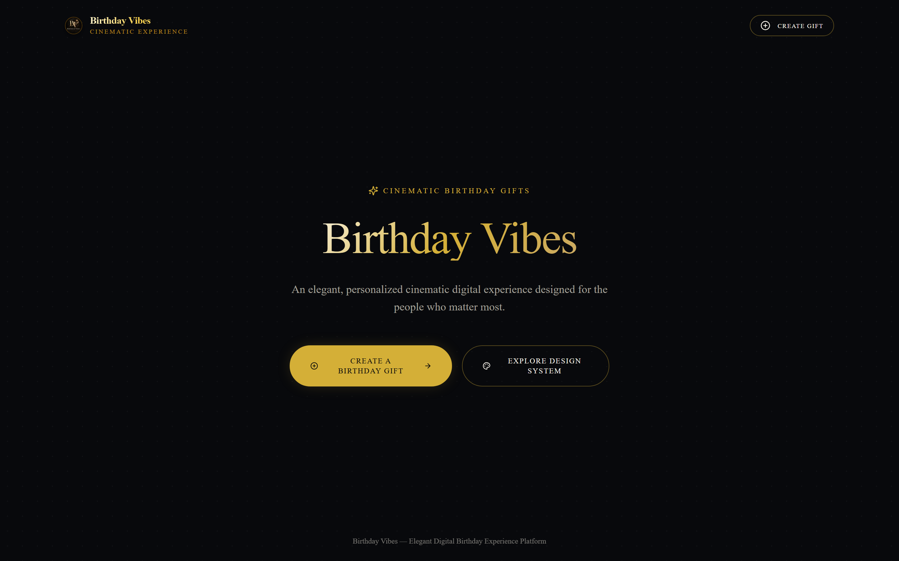
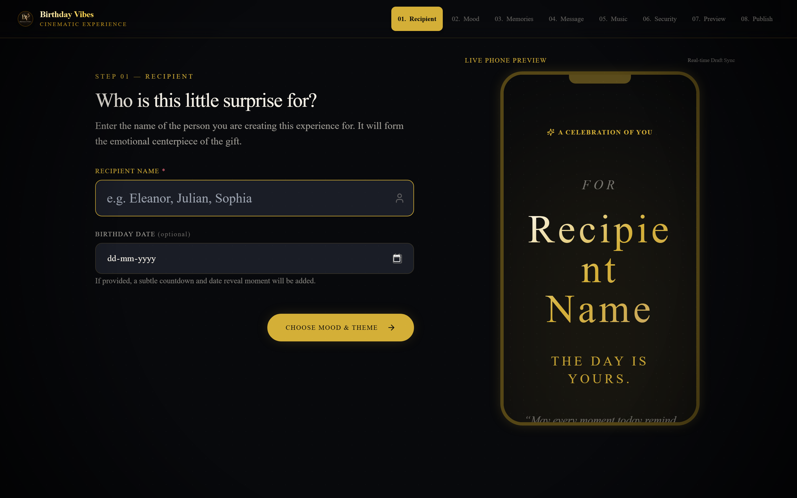
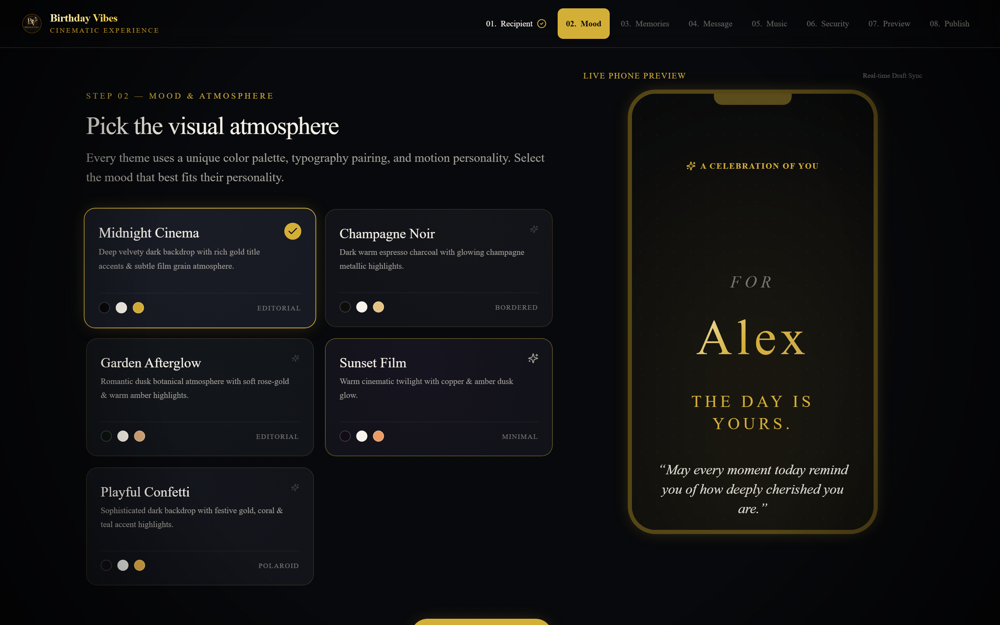
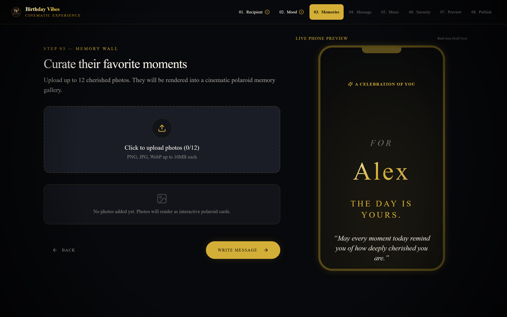
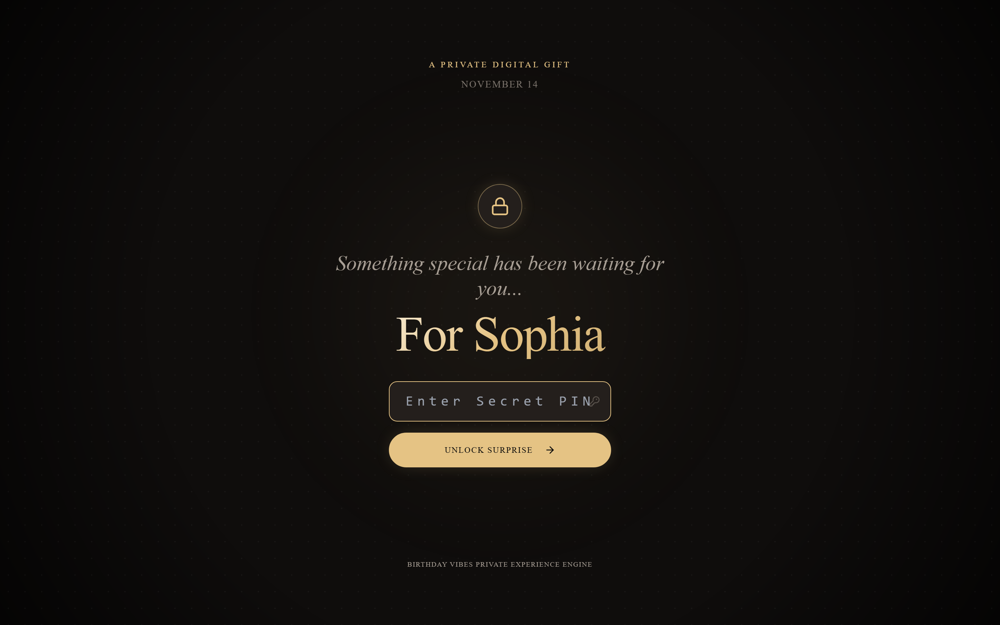
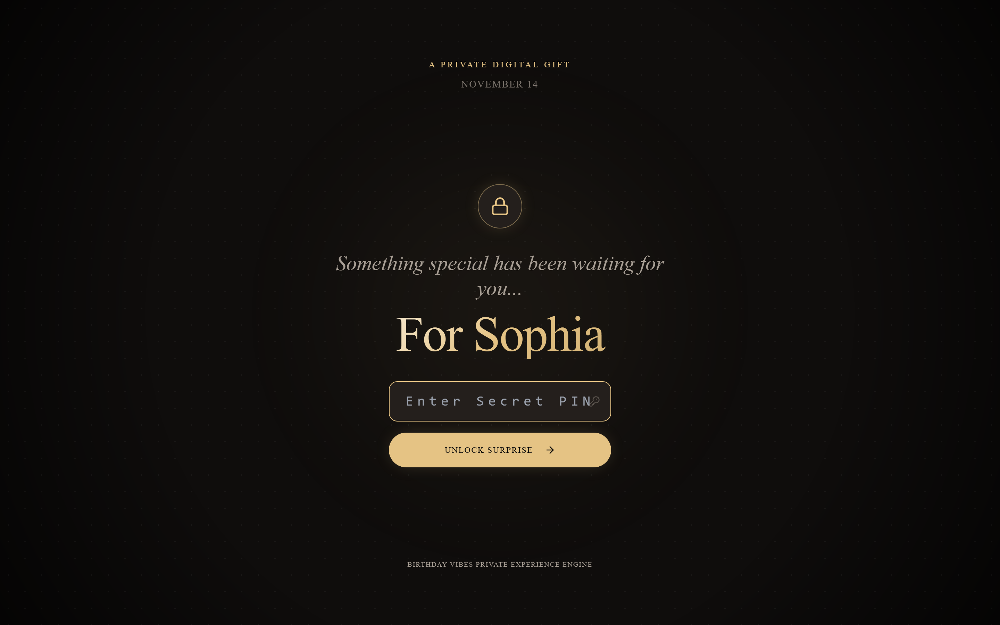
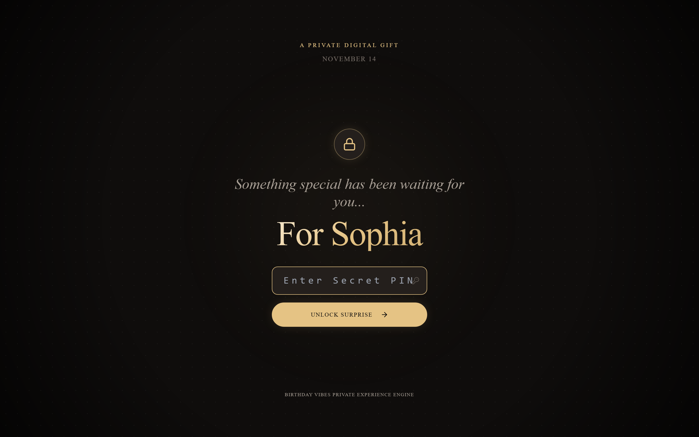
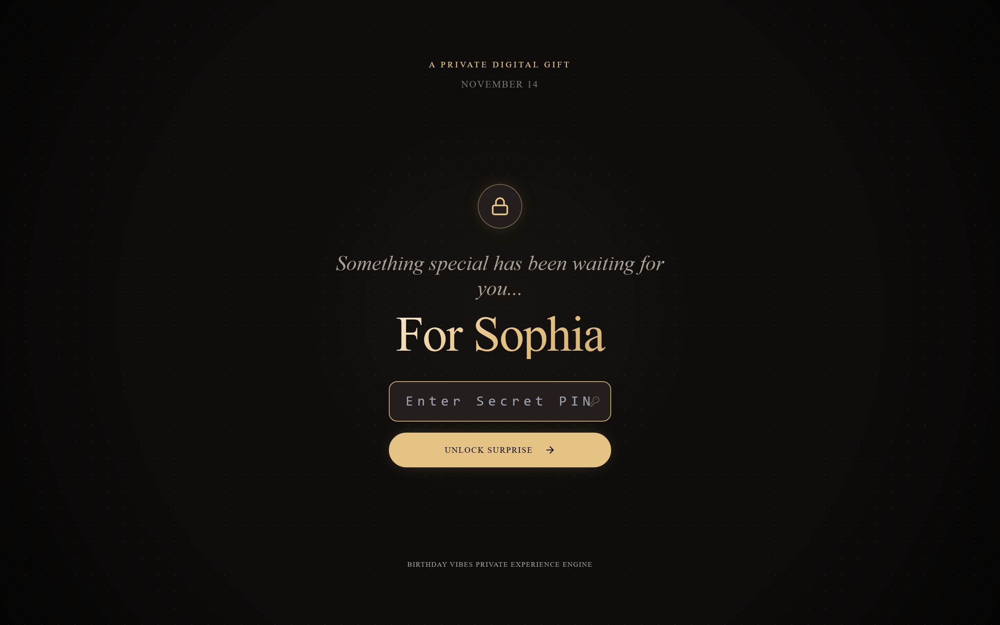
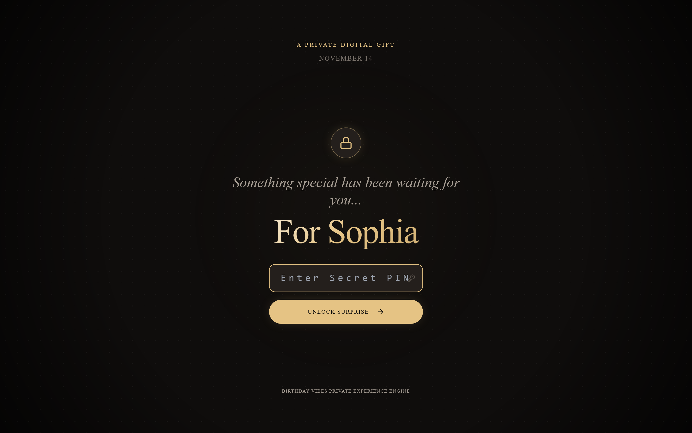
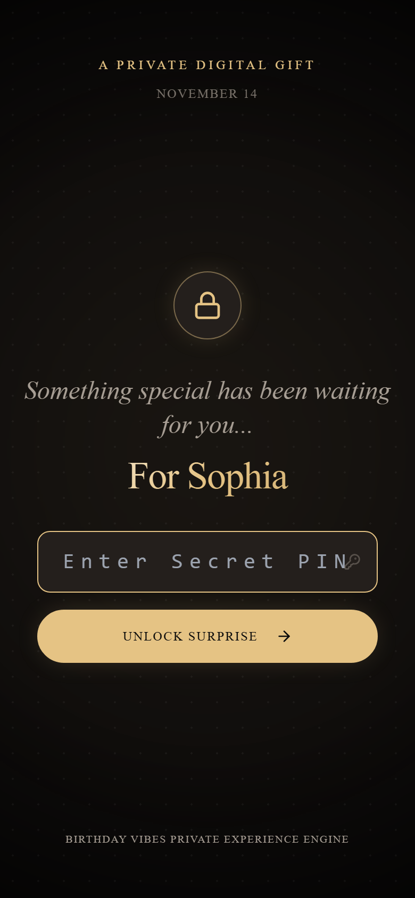

# Birthday Vibes

> A premium, cinematic digital birthday experience designed to feel like a personal gift rather than a static greeting card.

Birthday Vibes turns a birthday message into an interactive journey: a private cover, cinematic reveal, shared memories, an intimate letter, a birthday moment, and a celebratory finale.

## Overview

Birthday Vibes has two sides:

- **Creator Studio** — create and preview a personalized birthday experience.
- **Recipient Experience** — open a private share link, unlock it with a PIN, and move through the cinematic experience.

The product is built around a simple principle: **personalization, photography, typography, atmosphere, and motion should carry the experience—not dashboard UI or feature overload.**

## Product Preview

Birthday Vibes is a cinematic digital birthday-gift experience that combines personalized memories, private sharing, music, storytelling, and interactive birthday moments.

### Landing Experience



### Creator Studio



### Aesthetic Themes & Moods



### Memory Curation



### Recipient Locked Experience



### Recipient Memory Wall



### Letter & Candle Interaction





### Birthday Finale & Mobile Experience





## Experience Flow

### Creator

```text
Birthday
  → Recipient
  → Theme
  → Memories
  → Message
  → Music
  → Security
  → Preview
  → Publish
  → Share
```

### Recipient

```text
Private Link
  → Locked Cover
  → PIN Unlock
  → Cinematic Intro
  → Memory Wall
  → Letter
  → Birthday / Candles
  → Finale
  → Replay
```

## Design Direction

The visual system follows a luxury editorial and cinematic language:

- Deep black, espresso, ivory, champagne, and restrained accent colors
- Serif-led display typography paired with a modern sans-serif
- Film grain, vignette, atmospheric lighting, and tactile dark surfaces
- Deliberate scene transitions rather than constant animation
- Photography and typography treated as visual heroes
- Mobile-first interaction and generous touch targets
- Reduced-motion support

### Themes

| Theme | Direction |
| --- | --- |
| **Midnight Cinema** | Dramatic cinematic night with restrained gold highlights |
| **Champagne Noir** | Warm luxury evening with champagne and metallic accents |
| **Garden Afterglow** | Romantic twilight with an understated botanical atmosphere |
| **Sunset Film** | Warm amber/copper sunset and nostalgic film mood |
| **Playful Confetti** | Sophisticated celebration with a more playful energy |

## Technical Architecture

```text
┌─────────────────────────────────────────────┐
│                Next.js App                  │
│                                             │
│  Creator Studio       Recipient Experience  │
│       │                       │             │
│       └──────────┬────────────┘             │
│                  │                          │
│        ExperienceRenderer                   │
│                  │                          │
│            Server API Routes                │
└──────────────────┬──────────────────────────┘
                   │
                   ▼
┌─────────────────────────────────────────────┐
│                  Supabase                   │
│                                             │
│  PostgreSQL        Private Storage          │
│  RLS               Signed Media URLs        │
└─────────────────────────────────────────────┘
```

### Core Stack

- **Next.js / React / TypeScript** — application and routing
- **Tailwind CSS** — design system and responsive styling
- **Motion** — scene transitions and interaction animation
- **Supabase** — PostgreSQL, Row Level Security, and private media storage
- **Zod / React Hook Form** — validation and creator forms
- **qrcode.react** — recipient share QR generation

## Key Architecture Decisions

### Single Experience Renderer

The creator preview and published recipient experience use the same `ExperienceRenderer` architecture. This keeps the preview representative of the actual experience and prevents two separate implementations from drifting apart.

### Protected Recipient Payload

Public recipient pages expose only safe locked-cover information. Personalized message content, memories, music metadata, and protected media are retrieved only after successful server-side PIN verification.

### Private Media

Experience media is stored in a private Supabase storage bucket. The server issues short-lived signed URLs only after authorization.

### Creator Authorization

Creator access uses a high-entropy secret held in an HttpOnly cookie, while the corresponding server-side credential is stored as a hash rather than plaintext.

### PIN Security

PINs are not stored in plaintext. Verification uses salted PBKDF2 hashing with server-side authentication/session controls and rate limiting.

### Sharing

Published experiences use high-entropy slugs and canonical URLs. PINs are never placed in recipient URLs, QR codes, or share text.

## Security Model

The application is designed around a private-by-default model for personalized content:

- Server-only secrets are never exposed to client bundles.
- Supabase service-role credentials remain server-side.
- Protected recipient payloads require authorization.
- Private storage is used for experience media.
- Signed media URLs are short-lived.
- Recipient authentication cookies are HttpOnly and scoped to the experience.
- Invalid and unpublished experiences do not expose protected content.
- PIN attempts are rate-limited.
- Recipient pages use restrictive indexing metadata because experiences are intended to be shared privately.

> **Deployment note:** the current rate limiter uses an in-memory store. This is suitable for the current single-instance launch model but should be replaced with a shared rate-limiting service before horizontally scaling the application.

## Project Structure

```text
birthday-vibes/
├── src/
│   ├── app/                 # Next.js routes and API endpoints
│   ├── components/
│   │   ├── creator/         # Creator Studio
│   │   ├── experience/      # Recipient experience renderer/scenes
│   │   └── share/           # Sharing and QR UI
│   ├── lib/
│   │   ├── draft/           # Local draft repository
│   │   ├── experience/      # Experience data/repositories
│   │   ├── security/        # PIN/session/rate-limit utilities
│   │   ├── themes/          # Theme definitions and provider
│   │   └── ...
│   ├── types/               # Shared TypeScript types
│   └── ...
├── supabase/
│   └── migrations/          # Database schema and security policies
├── planing/                 # Product, UX, design, architecture and execution plans
├── public/                  # Static assets
├── .env.example             # Required environment variable reference
└── README.md
```

## Local Development

### Prerequisites

- Node.js 18+
- npm
- A Supabase project for persistent production functionality

### Install

```bash
npm install
```

### Environment

Copy the example environment file to your local environment and provide the required values:

```bash
cp .env.example .env.local
```

Required variables:

```text
NEXT_PUBLIC_SUPABASE_URL
NEXT_PUBLIC_SUPABASE_ANON_KEY
SUPABASE_SERVICE_ROLE_KEY
APP_AUTH_SECRET
PIN_HASH_SECRET_SALT
NEXT_PUBLIC_APP_URL
```

Never commit `.env.local` or real secret values.

### Run the development server

```bash
npm run dev
```

The application will be available at the local development URL shown by Next.js.

### Verify the project

```bash
npx tsc --noEmit
npm run lint
npm run build
```

## Supabase Setup

The production schema is defined under:

```text
supabase/migrations/20260913_phase4_schema.sql
```

The production Supabase configuration requires:

1. Applying the migration to the target Supabase database.
2. Enabling/retaining the defined RLS policies.
3. Creating the private `experience-media` storage bucket.
4. Configuring the required production environment variables.
5. Keeping the service-role key exclusively server-side.

## Deployment

Birthday Vibes is designed to run as a Next.js Node application with Supabase as its backend service.

Before deployment:

- Configure all production environment variables.
- Set `NEXT_PUBLIC_APP_URL` to the canonical production origin.
- Apply the Supabase migration.
- Verify the private media bucket.
- Verify RLS and storage policies.
- Run TypeScript, lint, and production build checks.
- Perform a live PIN/unlock and QR smoke test after deployment.

No production secrets belong in the repository.

## Production Readiness

The project has completed its application-level production readiness audit, including:

- Creator Studio visual refinement
- Recipient cinematic experience refinement
- Memory, letter, candle, and finale interaction QA
- Theme differentiation across five themes
- Motion and reduced-motion review
- Responsive/accessibility checks
- Secret/client-bundle audit
- Supabase RLS and private storage code audit
- Production build and lint verification
- GitHub secret-safety audit
- Production URL and canonical URL audit

Live Supabase connectivity and final hosting configuration must still be verified in the actual deployment environment before declaring the production deployment complete.

## Development Principles

- **Build the experience, not a dashboard.**
- **Prefer composition and atmosphere over decorative effects.**
- **Keep motion purposeful and performant.**
- **Use the same renderer for preview and recipient playback.**
- **Treat personalized content as private by default.**
- **Make mobile interaction a first-class experience.**
- **Fix real problems before adding features.**

## Current Scope

The current product focuses on the core personalized birthday experience.

Intentionally outside the current MVP scope:

- Payments and subscriptions
- Marketplace functionality
- AI-generated birthday content
- Complex user-account systems
- Social feeds or public discovery
- Microphone-based candle blowing

These can be evaluated independently after the core experience is proven in production.

## Repository

This repository contains the source code and planning materials for Birthday Vibes.

- GitHub: https://github.com/Manvith-S-Shetty/birthday-vibes

## License

No open-source license has been declared yet. Unless a license is added to the repository, the project should be treated as **all rights reserved**.
